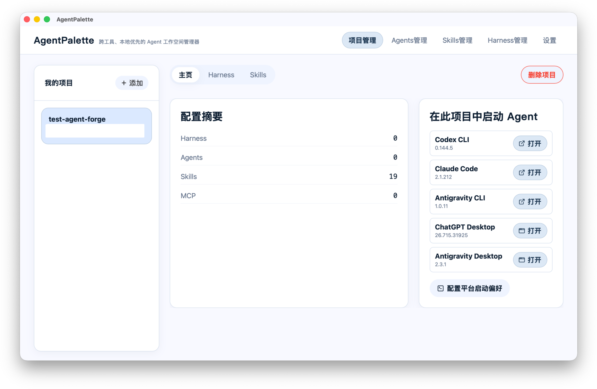
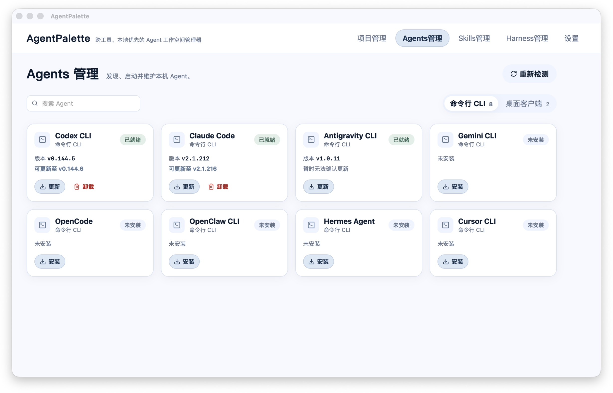
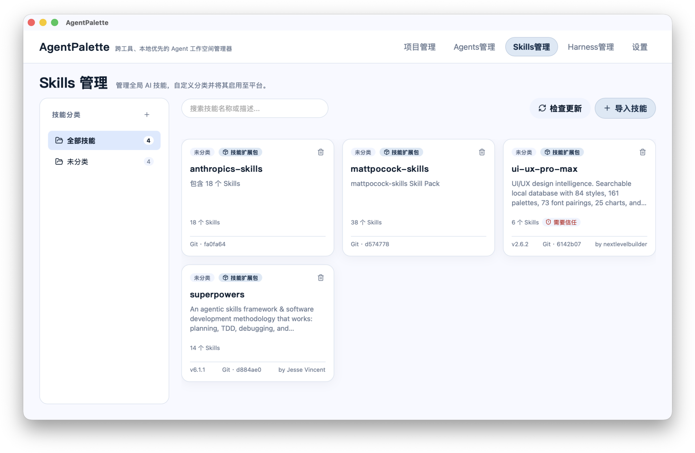
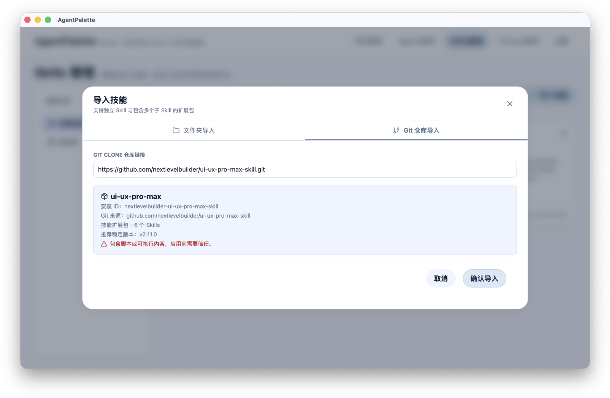
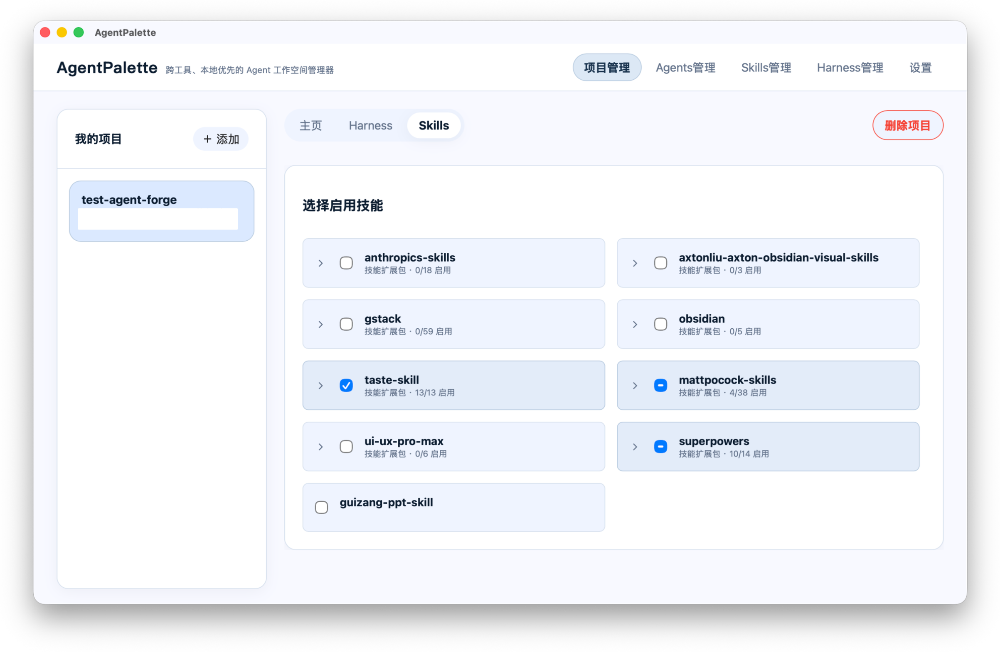
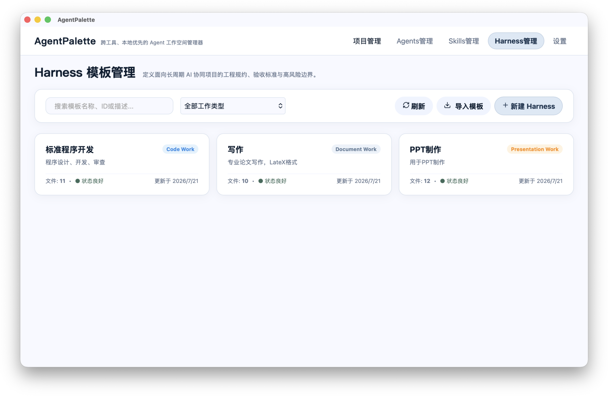
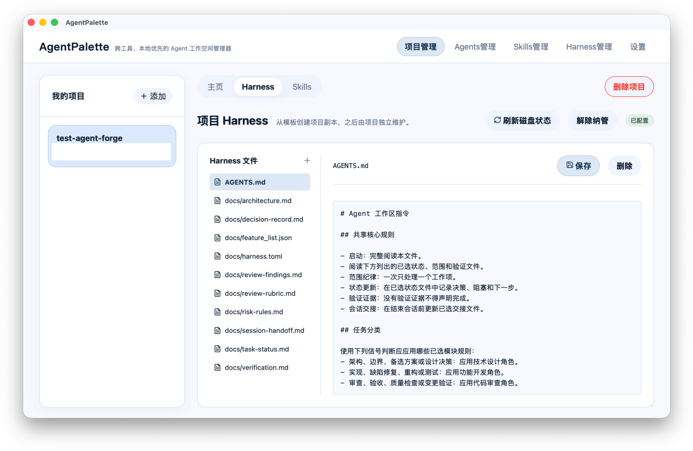
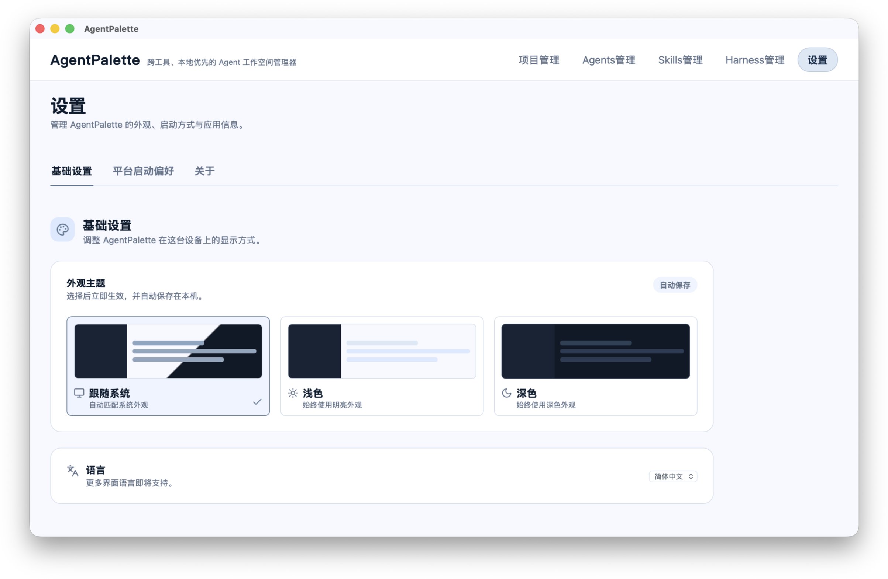

# AgentPalette

> 跨工具、本地优先的 Agent 工作空间管理器。

AgentPalette 是一个桌面应用，用来集中管理本机的 AI Agents、Skills 与 Harnesses，并将合适的能力组合应用到具体项目中。项目配置和技能目录保存在本机；应用不会复制你的项目目录。

[下载最新版本](https://github.com/Aimny2020/agentpalette/releases/latest) · [报告问题](https://github.com/Aimny2020/agentpalette/issues) · [参与贡献](./CONTRIBUTING.md)

## 目录

- [下载与安装](#下载与安装)
- [快速开始](#快速开始)
- [功能使用](#功能使用)
- [平台支持与限制](#平台支持与限制)
- [常见问题](#常见问题)
- [开发](#开发)
- [贡献、许可与品牌](#贡献许可与品牌)

## 下载与安装

请只从 [官方 GitHub Releases](https://github.com/Aimny2020/agentpalette/releases/latest) 下载与版本号对应的安装包。

| 平台 | 请选择的安装包 | 安装方式 |
| --- | --- | --- |
| macOS（Apple Silicon） | `aarch64` / `ARM64` `.dmg` | 打开 DMG，将 AgentPalette 拖入“应用程序”文件夹。 |
| macOS（Intel） | `x64` / `x86_64` `.dmg` | 打开 DMG，将 AgentPalette 拖入“应用程序”文件夹。 |
| Windows x64 | `.exe`（NSIS） | 双击安装程序，按向导完成安装。 |

### 安全提示

- 当前 macOS 安装包使用 ad-hoc signing，尚未完成 Apple notarization。首次启动如被 Gatekeeper 阻止，请确认安装包来自本项目官方 Release 后，在“系统设置 → 隐私与安全性”中选择仍要打开。
- 当前 Windows 安装包未进行代码签名，Microsoft Defender SmartScreen 可能显示“未知发布者”。仅在确认下载来源为官方 Release 后继续安装。
- AgentPalette 暂不提供自动更新。新版本请回到官方 Release 页面下载安装。

## 快速开始

1. 安装并打开 AgentPalette。
2. 在左侧“我的项目”点击“添加”，选择一个本地项目目录。
3. 打开“Agents 管理”，检测本机可用的命令行 Agent 或桌面客户端。
4. 打开“Skills 管理”，从本地目录或 Git 仓库导入所需 Skill。
5. 回到项目，在“项目技能”中启用该项目需要的 Skill；如有需要，再应用项目 Harness。
6. 在项目概览中选择已就绪的 Agent 启动。CLI 会在你配置的终端中以该项目目录启动。



## 功能使用

### 项目管理

项目列表位于左侧边栏。点击“添加”后选择本地目录，AgentPalette 会将它登记为工作区项目；点击项目可切换当前工作上下文。项目概览会显示已启用 Skill 数量，并提供“在此项目中启动 Agent”的快捷入口。

项目 Harness 和项目 Skill 都依赖当前选中的项目。删除项目只会移除 AgentPalette 中的登记信息，不会删除原项目目录。

### Agents 管理

“Agents 管理”会检测本机 Agent，并分别展示命令行 CLI 与桌面客户端：

- 使用搜索框查找目标 Agent，或切换“命令行 CLI / 桌面客户端”标签查看不同类型。
- 对可维护的 CLI，可先查看 AgentPalette 准备执行的命令，再确认安装、更新或卸载。
- 对已发现的桌面客户端，可直接打开应用。
- 需要在某个项目中工作时，请回到项目概览点击“打开”；CLI 会使用该项目目录启动。

卸载只会移除相应 CLI 的全局安装，不会删除你的项目或聊天记录。



### Skills 管理

Skill 是可复用的工作能力或说明集合。你可以：

- 通过分类、搜索和详情视图整理全局 Skill 目录。
- 点击“导入技能”，从本地文件夹或 Git 仓库检查并导入 Skill。
- 在详情中查看来源、成员文件、描述、信任状态与更新状态。
- 对来自外部来源、包含可执行内容的 Skill 审慎检查后再标记为可信。
- 检查更新；若删除的 Skill 已被项目启用，应用会提示你先从相关项目移除。





### 为项目启用 Skills

选择项目后进入“项目技能”，勾选该项目需要的全局 Skill 即可启用。这里的配置只影响当前项目；全局 Skill 目录本身不会被复制到项目中。



### 全局 Harness 管理

Harness 是一套可复用的项目工作约束与文件模板。通过“Harness 管理”可以新建模板、维护模板文件、检查基础依赖与语法状态，并按工作类型或语言筛选模板。模板库是全局的，适合沉淀团队或个人的工作规范。



### 项目 Harness

在选定项目的“Harness”页面中，从模板库选择合适模板并应用。应用时，模板文件会完整复制到项目中；之后项目副本可独立编辑，不会自动与全局模板同步。

对于已纳管的项目 Harness，你可以在应用内浏览、编辑、新建或删除文件。保存前请确认改动范围；删除项目 Harness 文件会直接影响对应项目工作约束。



> 截图待补充：`docs/images/README/06-project-harness.png`

### 设置

“设置”包含三类内容：

- **基础设置**：选择跟随系统、浅色或深色主题；当前界面语言为简体中文。
- **平台启动偏好**：选择启动 CLI 时使用的终端、以新标签页或新窗口打开，并配置命令预览、环境检查、权限摘要与复制命令兜底等偏好。
- **关于**：查看当前应用版本；自动更新暂未开放。

启动偏好需点击“保存启动偏好”后生效。离开未保存的设置页时，应用会提示保存或放弃修改。



## 平台支持与限制

- 支持 macOS（Apple Silicon、Intel）与 Windows x64。
- 当前不提供 Linux、MSI、移动端安装包或自动更新。
- 任务中心和更完整的项目级运行控制仍在后续开发计划中。
- 已导入的外部 Skill 可能包含脚本或其他可执行内容；请确认来源可信并检查内容后使用。

## 常见问题

### macOS 提示“无法验证开发者”怎么办？

确认安装包来自官方 Release 后，在“系统设置 → 隐私与安全性”中选择仍要打开。不要对来源不明的安装包绕过系统安全提示。

### Windows 出现 SmartScreen 警告怎么办？

请先确认下载链接属于官方 GitHub Release，文件名称和版本号与 Release 页面一致。当前安装包未签名，因此可能显示未知发布者。

### 为什么没有检测到 Agent？

在“Agents 管理”点击“重新检测”，确认对应 CLI 已正确安装并且位于系统 `PATH` 中；桌面客户端则需已安装在系统应用目录。必要时检查终端权限后重试。

### 删除项目会删除我的文件吗？

不会。删除项目只移除 AgentPalette 的本地登记记录；你的项目目录和文件保持不变。

### Harness 应用后会随着模板更新吗？

不会。应用模板会将文件复制到项目中，之后项目副本和全局模板彼此独立。

## 开发

仅在需要从源码构建或参与开发时，才需要配置 Node.js、Rust 与 Tauri v2 系统依赖。普通用户应优先使用安装包。

```bash
npm ci
npm run tauri:dev
```

发布或提交前运行：

```bash
npm run version:check
npm run lint
npm run test:run
npm run build
cargo fmt --manifest-path src-tauri/Cargo.toml -- --check
cargo test --manifest-path src-tauri/Cargo.toml
cargo clippy --manifest-path src-tauri/Cargo.toml -- -D warnings
```

应用版本必须在 `package.json`、`src-tauri/Cargo.toml` 与 `src-tauri/tauri.conf.json` 中保持一致。

## 贡献、许可与品牌

欢迎提交 Bug、功能建议和 Pull Request。提交前请阅读 [贡献指南](./CONTRIBUTING.md)。安全问题请勿公开创建 Issue；请通过仓库维护者的私密联系方式报告，并附上复现步骤与影响说明。

本项目代码采用 [Apache License 2.0](./LICENSE)。这允许使用、修改、分发和商业使用，但须保留许可证与版权声明。

“AgentPalette”名称、Logo 和其他品牌标识不随代码许可证授权。Fork 或衍生版本不得暗示其为官方发布；详细规则见 [品牌使用说明](./BRAND_USAGE.md)。

## 截图维护约定

README 图片放在 `docs/images/README/`。当前使用 `01` 至 `08` 的固定文件名；建议采用 16:10 或 16:9、宽度至少 1600px，并在提交前遮盖用户名、本地绝对路径、令牌、私有仓库地址与其他敏感信息。

## 版本记录

重要变更见 [CHANGELOG.md](./CHANGELOG.md)。
